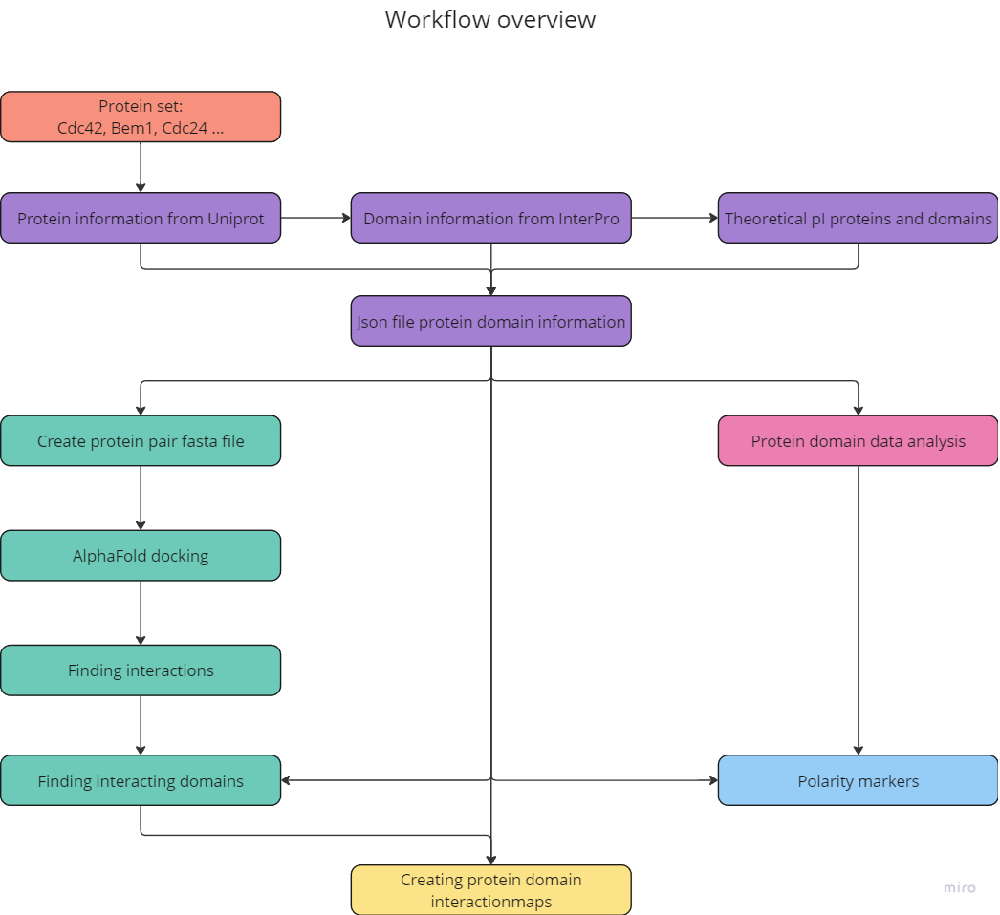
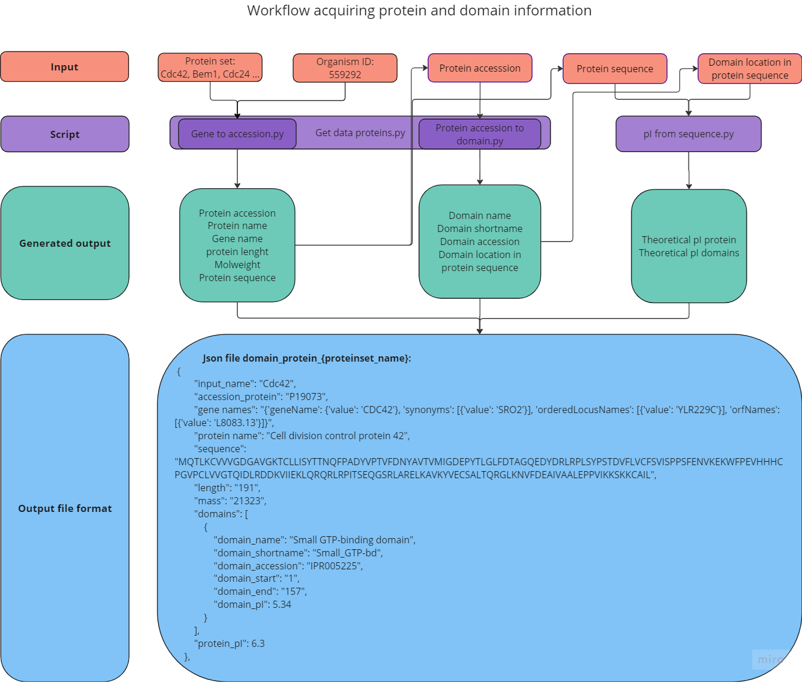
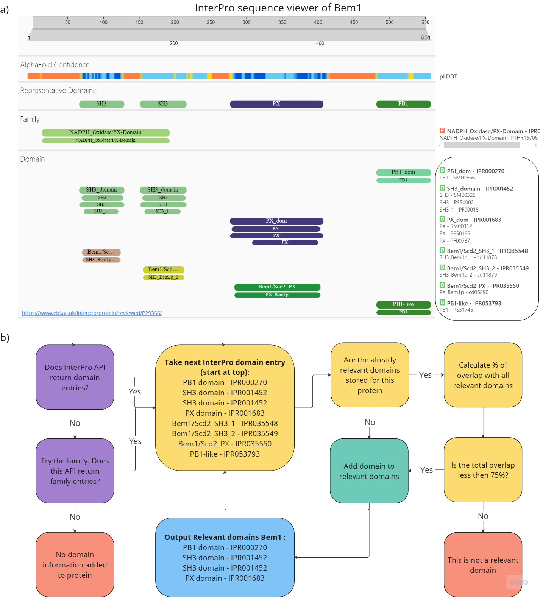

# MEP-Exploring-protein-domain-interaction-network-of-yeast-polarity

# Methods

This chapter will describe the tools and scripts developed to gather protein domain data, dock protein pairs, identify interacting domains, and create an interaction map. Below is an overview of the workflow, where the numbers specify the different sections within this chapter.



*Figure: Overview of the workflow, outlining the main steps involved. The numbers correspond with the section numbers of this chapter.*

## Pipeline Development to Obtain Protein and Domain Data

The first step is to gather comprehensive information about polarity proteins. Specifically, we aim to obtain the full protein name, protein accession number, gene names, length, sequence, molecular weight, and domains. For each domain, we are interested in the following details: domain name, domain accession, short name, location within the protein, and the isoelectric point for both the protein and the domains.

| Protein Information           | Domain Information              |
|-------------------------------|---------------------------------|
| Input Name                    | Domain Name                     |
| Protein Accession Number      | Domain Accession                |
| Protein Name                  | Domain Short Name               |
| Gene Name                     | Domain Location                 |
| Protein Length                | Domain Isoelectric Point (pI)   |
| Protein Sequence              |                                 |
| Molecular Weight              |                                 |
| Protein Isoelectric Point (pI)|                                 |

### Databases

We use databases to acquire the protein and domain information as specified in the table above. We refer to the UniProt database for the protein information we want to acquire. UniProt provides protein sequences and functional information about proteins. Information about the protein of interest can be obtained by entering the protein or gene name and the organism's ID. However, UniProt does not provide information on the domains within the protein. For this purpose, we will use InterPro. InterPro combines protein information from multiple databases, highlighting important sites within the protein sequence, such as families and domains. To access the specific protein page, we use the protein accession number obtained from UniProt as input. The protein accession number is a unique identifier, ensuring that only the specific protein of interest appears in the database.

### API

While one can manually acquire information on the proteins of interest from the databases' websites, we aim to obtain this information automatically for large sets of proteins. Both databases offer APIs (Application Programming Interfaces) to facilitate this. The API acts like a waiter in a restaurant; you (the user) request protein information, and the API fetches the data from the database server, returning the information to you. APIs operate with a base URL, to which additional parameters can be appended to specify the requested information. We utilize the GET method to send requests to the API server, which returns the requested information in JSON format. This enables us to extract all or only the specific information needed. Each database employs a distinct URL structure.

The used API format for UniProt is somewhat more streamlined. We use `UniprotkbClient.search`, providing it with a gene name, organism ID, and specifying the response format, as well as the information fields required. We request the following information: protein accession number, gene names, protein name, length, mass, and protein sequence, as shown below:

```python
UniprotkbClient.search(
    query=f"(gene:{gene_name}) AND (organism_id:{organism})",
    format="json",
    fields=["accession", "gene_names", "protein_name", "length", "sequence", "mass"]
)
 ```

The InterPro API follows a specific URL format specified in the documentation. To acquire domain information for every protein, we construct additions to the base URL as follows: Entry/InterPro defines that we want InterPro entries, protein/UniProt/{accessionnumber} specifies for which protein identified by its UniProt accession number. We specify the type of entry we seek, which is the domain (?type=domain), set the page size to the maximum allowed (page_size=200), and request the domain's short name in the extra fields (extra_fields=short_name).
```python
API_url_InterPro = "https://www.ebi.ac.uk:443/interpro/api/entry/InterPro/protein/UniProt/{accessionnumber}/?type=domain&page_size=200&extra_fields=short_name"
 ```

This URL provides metadata, protein data, and extra fields for each domain within a protein. The metadata includes basic information about a domain, such as its name, accession number, and source database. The protein data informs us about the protein we requested and the location of the domain within it. Additionally, we request the short names of the domains in the extra fields. From this information, we extract the domain names, domain accessions, domain short names, and the start and end positions of the domains within the protein sequence.

### Obtaining Information on Proteins and their Domains
The script get_data_proteins_v2.py is designed to process a list of protein names, retrieves associated data from the UniProt database and acquires relevant domain information for each protein from the InterPro database. Figure below provides an overview of the used scripts, the required input and the generated output.



Figure: Diagram of the pipeline for acquiring protein domain information from databases. Showing the input needed for each script, the generated output and the style of the output file.

To use this script, a comma-separated list of proteins as a text file needs to be provided, and an organism ID (559292 for Saccharomyces cerevisiae) should be specified. For each protein in the list, the script calls the function get_accession_from_gene_and_organism from the gene_to_accession module. This function constructs a query to the UniProt API using the provided gene name and organism ID, retrieving the protein accession number and other protein details. If successful, it returns a dictionary containing the retrieved data. If no data is found, it returns None.

Once the protein accession is found, the script calls the accession_to_domain function from the protein_accession_to_domain_v3 module to retrieve domain information. It requests the InterPro API to obtain domain entries and associated information for the given protein accession number. It then returns details about the domains, including their metadata, associated protein information, and locations. If domain information is not available, it attempts to retrieve family information instead. Additionally, the module includes functions such as find_relevant_domains, which processes domain data to filter and extract relevant domains.

After processing all proteins, the script writes the combined protein and domain information to a JSON file and logs any errors encountered in a separate text file.

### Selecting Relevant Domains
We retrieve all InterPro domain entries through the API as described in the API section. However, multiple entries often represent the same domain, as observed in the sequence viewer for Bem1 shown below in Figure 1. Our goal is to avoid redundancy, ensuring that the same domain is not used multiple times. Additionally, some domains may be distinct yet partially overlapping, requiring careful consideration of which domains to include.



Figure 1: Panel (a) displays the sequence viewer for Bem1 from the InterPro website. Each InterPro domain entry is represented in a unique color in the sequence viewer, and within the circle on the right side listed with a green "D". The representative domains and family entries are listed above the domain entries. Panel (b) presents a flowchart illustrating the process of selecting relevant domains from InterPro entries, along with input and output examples for Bem1.

The InterPro website features a section for representative domains in the sequence viewer (see Figure 1, Panel (a)), which assists users in selecting relevant domains. Unfortunately, this representative domain information is not accessible via the InterPro API, so we must independently define which domains are relevant. To achieve this, we calculate the overlap of each new domain with all previously annotated relevant domains. If the overlap is less than 75%, we classify it as a relevant domain for that protein.

For some proteins, no domain information is available. In such cases, the family is typically annotated as the representative domain on the InterPro website. Therefore, when no domain information is accessible for a protein, we request the relevant family entries and consider these entries as domains. If no domain or family entries are available, we do not assign any domains to the protein. An overview of the process for annotating domain entries as relevant domains is illustrated in Figure 1, Panel (b).

### Isoelectric Point
The isoelectric point (pI) for proteins and their domains is the only information that has not yet been obtained. Although the pI is generally available for most proteins, it is not provided in the databases for protein domains. To address this, we utilize the ExPASy web tool, which employs ProtParam to calculate several properties of protein sequences, including the theoretical pI. This calculation is based on the ionization constants, or pK values, of seven charged amino acids, as defined by [Bjellqvist et al. (1993)].

Since the website cannot be accessed via an API, the script pI_from_sequence.py uses a POST request to the ExPASy ProtParam web tool along with the protein sequence to calculate its theoretical pI. The script then parses the HTML response using BeautifulSoup to extract the pI value. It also reads a JSON file containing protein and domain data. For each protein, the script calculates the pI for the entire protein sequence. It subsequently iterates through the protein's domains, extracting the corresponding sequence based on start and end positions to calculate their pIs. Finally, the script updates the JSON file with the computed pI values.

### Protein and Domain Data Analysis
We analyzed protein domain characteristics by examining properties such as protein and domain length, isoelectric point, number of domains per protein, and domain coverage percentage across different protein sets. We used the script data_distributions_hist.py to generate Kernel Density Estimate (KDE) plots that visualize these distributions.

To identify polarity-specific domains, we assessed their occurrence in the dataset versus the complete yeast proteome. The script domain_analysis_withp-value.py calculates the ratio of domain occurrences, which is then compared to ratios in the full yeast proteome to generate an enrichment score. The significance is assessed using the hypergeometric test:

Enrichment Score =
(Domain Occurrence in Protein Set/
Total Domains in Protein Set)
/
(Domain Occurrence in Yeast Proteome/
Total Domains in Yeast Proteome)

 
Domains with an enrichment score above 1 and a p-value below 0.05 are considered significantly overrepresented.

### Docking Protein Pairs
The next step involves docking protein-protein pairs. We will discuss the tools used and the setup process.

### Tools for Docking Protein Complexes
We initially opted for the SpeedPPI pipeline due to its faster processing and lower storage requirements compared to AlphaFold2 and AlphaFold multimer. Due to challenges in setting up SpeedPPI on the DelftBlue cluster, we shifted to using AlphaFold2 on DelftBlue and AlphaFold3 on an online server.

AlphaFold3 was used for its efficiency, though it had limitations, such as docking only 20 pairs per day.
AlphaFold2 was used on DelftBlue, but required setting up a specific environment and submitting individual jobs for execution.
Setting Up AlphaFold3 on the Online Server
The AlphaFold3 online server allows uploading JSON files with up to 100 job descriptions. The script fasta_file.py converts protein domain data in JSON format to FASTA format, and AF3_infile_generator.py creates pairwise combinations for job descriptions, saving them in JSON format for AlphaFold3. The jobs must be started manually on the server.

### Setting Up AlphaFold2 on DelftBlue
AlphaFold2 was set up in the DelftBlue cluster by transferring folders from the Biotechnology department. FASTA files were created for each protein pair using fasta_proteinpair_generation.py. A Bash script was created for each protein pair to run AlphaFold predictions, managed by the DelftBlue job scheduler.

### PyMOL
We used PyMOL for visualization and evaluation of predicted structures. To color the protein pair based on pLDDT scores, we used the PyMOL plugin PyMOL-colour-AlphaFold. We also used the align and cealign functions to determine the similarity between structures by calculating RMSD.

### Finding Interactions
Docking with AlphaFold returns structure files in PDB and CIF format. We used the CIF format to identify interacting atoms by searching for those within 4 Ångström. The script AF3_domain_interaction_cif_v2.py identifies interactions by analyzing contacts between atoms and applying a pLDDT score threshold of 50 to ensure reliability.

The script assembles contact information into TSV files, which are further processed using cleaning_contactfiles.py to extract unique residue-residue interactions.

Identifying and Counting Domain-Domain Interactions
The script domain_interaction_data.py processes these interactions, counting the number of interacting residues to estimate interaction strength for each domain-domain interaction. The resulting data is saved in a TSV file for further analysis.

### Developing Interaction Maps
We developed two types of maps: a domain interaction map and a community map. The Python module NetworkX, along with Matplotlib and Netgraph, was used to create these maps.

### Pipeline for Domain Interaction Map
The script domain_map_pI.py uses NetworkX to create a domain interaction map that represents interactions between domains. It calculates node sizes based on domain length, and colors represent pI values.

### Pipeline for Community Interaction Map
The script communitymap_v3.py generates a community interaction map by grouping domains into communities (proteins) and visualizing their interactions. Netgraph is used to draw the community structure, with specific colors assigned to nodes representing different domains.

### Evaluating Polarity-Specific Domains as Potential Markers
We evaluated domains identified as polarity-specific by examining sequence similarity, structure, and protein abundance. The script plot_protein_abundance.py extracts abundance data from the Yeast Genome Database. MSA was conducted using Clustal Omega to determine sequence similarity, and PyMOL's cealign function was used to identify the most representative domain structure.